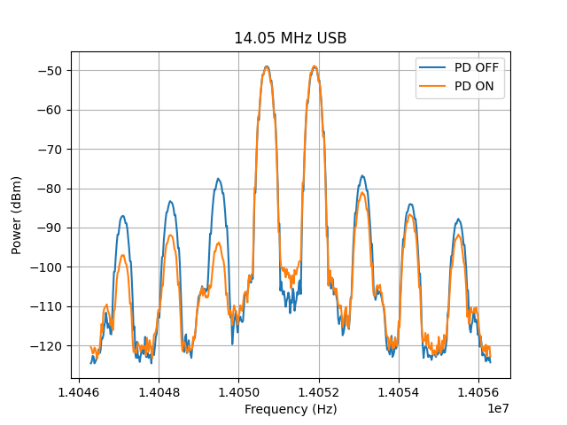

# IMD Messurements on QMX using tinySA Ultra+
## General Mess Setup
- To be sure, there are no intermodulation products created inside of the tinySA, I use 80dB external attenuation.
- TinySA and QMX are connected via USB to the Linux computer.
- Hamlib rigctl has to be installed.
- Set the SSB-Input to Two-tone.
- Enter the serial console once and exit it via the "exit" menu item.
  QMX now remembers the exit button as last choosen option. This is currently needed, because setting PD is not updated immediately when setting it via CAT. The python program therefore enters and exits the Configuration menu.

## Python program
- Uncomment the fitting vfo line or edit the frequencies, you want to test.
- execute main.py

## Output
An out folder is created containing...
### measurement.txt
A table with the following columns:
- frequency
- mode
- phase predistortion
- 2 IMD3 values (dBc)
### Images
- with phase predistortion on and off

## Samples
The samples folder contains my own measurements on a QMX80, QMX20(extended by 6m) and QMX+, e.g.:

